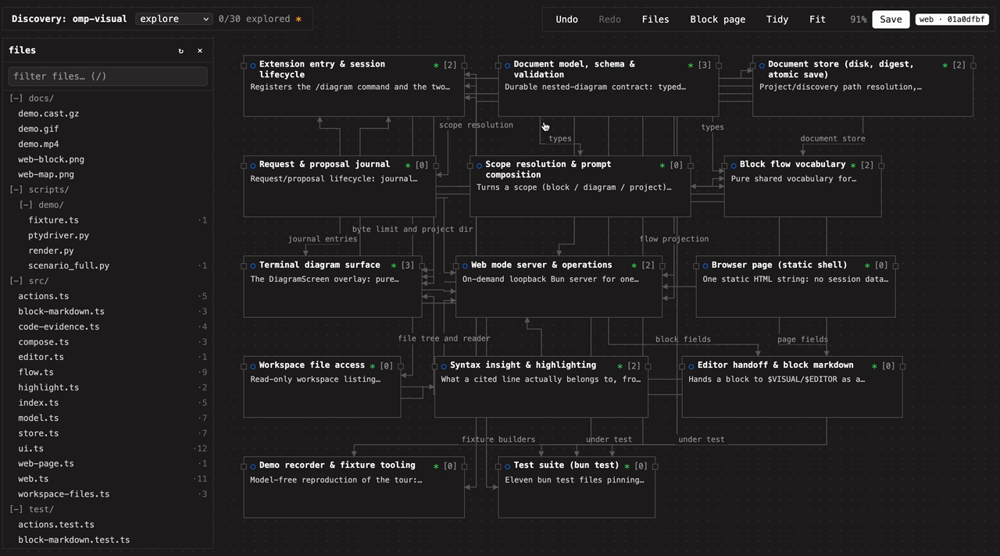

# omp-visual-planner

An OMP extension for planning systems and mapping codebases as nested blocks. It is built for OMP, not as a plugin for other harnesses. Work on one block at a time in a terminal or browser; use the map when relationships or layout matter. A model can stage a proposal, but only a person can accept it.

## What is in it

- **One nested document.** Blocks nest into diagrams to any depth, with stable ids, authored order, labelled edges, source references and `uses` links. `.omp-visual-planner/architecture.json`, schema 1, explicit atomic saves that refuse to overwrite an outside edit; legacy boards import.
- **Three purposes.** `brainstorm` (ideas, no status), `plan` (todo → planned → done, Execute), `explore` (unexplored → explored, citations, grounded mode).
- **Verbs, previewed and scoped.** Refine, Break down / Expand / Map inside, Investigate, Replan, Prune, Execute — each composes one exact prompt for the block, subsystem or project you point at and previews it before anything is sent. `Esc` cancels; Enter submits.
- **Judged related context (Jev).** A request narrower than the project arrives with the blocks outside its scope already ranked. The session's `judge` role — a System One decision model, **Jev** by default (`openrouter/~typesafe/jev-latest`), or Laya behind the same wire — is asked one narrow yes/no question per outside block, and those at p ≥ 0.7 join the prompt as a `## Related context` section. Measured at roughly $0.00003 and 0.3 s for three blocks. See [Related context](#related-context).
- **Reviewed proposals.** A model can only stage through `visual_planner_propose`, with every changed field shown before and after; only a person accepts, and acceptance is one undoable, unsaved edit. Replan and prune cannot drop work the human already settled.
- **Reuse that survives a move.** Extract lifts a block to share it, its former sibling links become `uses`, and Execute reads a use as a dependency. See [Reuse](#reuse).
- **Execute as dispatch.** Only written leaves with acceptance criteria run, in the venue the block states (`here`, `subagent`, `worktree`); the plugin hands the work to OMP and never marks it done.
- **Visual design as a block facet.** A block a person looks at is marked `surface` (`page` or `component`). A surface without a wireframe and a mockup points at **Sketch**, which draws a fenced `wireframe` in its description and a sandboxed HTML mockup; **Screens** shows every page and component together; Execute over a surface builds what they show. See [Design a page or component](#design-a-page-or-component).
- **Parallel block requests.** Mark blocks with `m` and run one verb over all of them: the session spawns one subagent per block, and each proposal comes back for its own review. See [Explore several blocks at once](#explore-several-blocks-at-once).
- **Change plans for an existing repository.** `/diagram change` opens a new plan under `.omp-visual-planner/changes/`, oriented by the codebase map and the blocks marked on it; the model reads the code first and each block cites the files it changes. See [Change an existing codebase](#change-an-existing-codebase).
- **Two surfaces.** The terminal TUI and a loopback web view of the same session, sharing focus, undo and the store.
- **Evidence over confidence.** Every block is `observed`, `inferred` or `unknown`; `observed` needs a source, and explore can hide what is not grounded.
- **A skill for when no document is open.** [`skills/decompose`](skills/decompose/SKILL.md): the same decomposition as nested bullets in one markdown file, with `/tree` as the history.

The skill is the agent plus `/tree`, which OMP and pi already have. The agent edits one markdown file of nested bullets, the way Logseq nests blocks. `/tree` is how you go back to an earlier decomposition. No second integration. OMP loads the skill with this plugin. For pi, link the directory:

```sh
ln -s /path/to/omp-visual-planner/skills/decompose ~/.pi/agent/skills/decompose
```

[](docs/visual-planner-demo.mp4)

[31s tour](docs/visual-planner-demo.mp4), stitched from real browser captures of this repo's discovery document, one per step: the walk, the map, a file found in the tree with the blocks that cite it, the citing block, the Investigate preview before submit, and the `?` sheet. The still above is the map with the file tree open.

## Install

From a checkout:

```sh
omp plugin link /path/to/omp-visual-planner
omp plugin doctor
```

The link is user-scoped and follows changes in the checkout. Run `/reload-plugins` in an open session after editing. For a project-only install, link or copy the checkout to `<repo>/.omp/extensions/omp-visual-planner`. To load it explicitly without installation:

```sh
omp --no-extensions -e /path/to/omp-visual-planner/src/index.ts
```

The package is private; the npm install route is not available yet.

## Try it without a model

From this checkout:

```sh
DEMO_DIR="$(mktemp -d)"
bun scripts/demo/fixture.ts "$DEMO_DIR"
omp --cwd "$DEMO_DIR" --no-extensions -e "$PWD/src/index.ts"
```

In OMP, run `/diagram open architecture.json`. Move through the outline with `j`/`k`, press `Enter` to open the block's page, move to its source reference with `j`, and press `Enter` again. Scroll with `j`/`k`, arrows, `PgUp`/`PgDn`, or `g`/`G`; `Esc` returns. `t` previews a block replan; `a` offers project replan and prune. **Esc cancels a preview; Enter submits its request to the model.** The generated directory is disposable.

## Commands

| Command | Action |
|---|---|
| `/diagram` | Open the current document or create one |
| `/diagram new [brainstorm\|plan\|explore]` | Create a document (default: plan) |
| `/diagram open <path>` | Open a document; legacy boards import automatically |
| `/diagram draft [brainstorm]` | Ask the model to draft a plan or mind map |
| `/diagram discover [path]` | Ask the model to map an existing codebase (default: cwd) |
| `/diagram change [goal]` | Plan a change to this codebase as a new plan; the model reads the code first |
| `/diagram web` / `/diagram web stop` | Open/stop the browser view of this session |

The terminal opens on a nested outline beside the selected block's page. Browsing, the page shows only what is written, and flags what a plan block still lacks. Its last line is the one next step for that block; `r`, `b`, `t`, and `X` are the other verbs. `Enter` opens every field with a cursor (`j`/`k` picks one, `Enter` edits it, `Esc` returns). `space` advances the status; `n` selects the next open block. `R` reviews a staged proposal. `U` links this block to a reusable one anywhere in the document, and `M` lifts it, with everything inside it, to a shared level. The outline marks a block others use with `×N`. `v` switches to the coordinate map, `E` edits the whole block as Markdown in `$VISUAL`/`$EDITOR`, and `s` saves. The status line lists the keys that work where you are; `?` groups all of them.

The browser has the same outline on the left and the same page or walk beside it. The top bar holds the document, its progress, undo, the file tree, the map and Save; the status line at the bottom lists the keys, and `?` opens the full sheet. On the page, the next step is the first button and the one sentence under the buttons says why. **Uses…** and **Extract…** are the same two jobs as `U` and `M`, in a dialog you can filter.

Brainstorm, and an explore block you have not settled, open on a **walk**: one **focus diagram** with the focused block as a card, its parent above, the blocks it links from on the left and to on the right — each link an arrow carrying its label, except a reuse link, which is dashed and unlabelled: `uses` on the left, `used by` on the right — and what is inside it below. The arrow keys move the highlight around it and `Enter` goes to the highlighted block (`Esc` recentres); `j`/`k` still move the outline, and a pane too narrow to draw the diagram falls back to a stacked list with the same cursor. Dump a line onto the focused idea (Enter in the browser, `O` in the terminal). In explore, a citation is the subtitle, uncited blocks are dim, and **grounded** (`g`) hides them. `Enter` on a cited block opens the source; `i` (or `Enter` on an uncited one) opens the editable page. Mark a block explored and it stays on the full page. Plan documents stay on that page. **Map** is coordinates. Both views share the session.

| Purpose | Block actions | Human status |
|---|---|---|
| brainstorm | Refine, Expand, Replan | none |
| plan | Refine, Break down, Replan, Execute | todo → planned → done |
| explore | Investigate, Map inside, Replan | unexplored → explored |

## Use cases

Seven sessions. In each one the model may only stage a proposal. You accept it, or you do not. Saving is a separate key.

### Brainstorm an idea

You have a product thought and no structure. You do not want implementation steps.

```text
/diagram new brainstorm
```

The document opens on a walk. Dump the first line (`O` in the terminal, Enter in the browser). Dump the next line onto that idea to nest it, or onto the empty project to add a sibling. `r` previews Refine for the focused idea: title and note only, no new blocks. `b` previews Expand: sub-ideas come back as children. Accept the diff, then walk into one child and repeat. `space` does nothing here. Ideas have no status. There is no Execute verb. Once the idea has a note, the next step is **Implement**: it switches the document to a plan and opens Execute on that block.

When the map is the thing you want to look at, `v` (or Map in the browser). Relationships are context, not a schedule.

### Explore a codebase

You are new to a repository and want a map grounded in files, not a redesign.

```text
/diagram discover .
/diagram web
```

Discover submits a project-scope request. The proposal is a document of blocks with source ranges. Reject anything that cites a path you cannot open. After accept, the walk shows a citation under each block. Uncited blocks are dim. `g` hides them. Open a citation (`Enter` on the source row, or the path in the browser file tree). **Inspect syntax** is a Tree-sitter range, not a type or a reference.

`r` on one block is Investigate: it may fill description, evidence, sources, and children, and only from code it read. `b` is Map inside, for one subsystem, not the whole repo. `space` marks the block explored and leaves the walk for the full page. Do not use this purpose to plan new work. That is a plan document.

### Research a question interactively

You are not mapping a repository and you are not shipping a feature. You are pulling a question apart and keeping the evidence next to the claim.

```text
/diagram new explore
```

Skip Discover. Author the question yourself (`o` in the terminal, **+ block** in the browser), then the competing claims as its children (`O`, or **+ inside**). Do not use Map inside for that. Map inside asks the model to derive children from code. Each claim gets a source reference (`path` or `path:10-40`) only after you have opened that range. Evidence stays `unknown` or `inferred` until a source exists. `observed` without a source is refused. Investigate (`r`) on one claim, review the diff, and reject a citation you did not check. `g` hides claims that are not grounded. `space` marks a claim explored. `n` selects the next open one.

This is the same document type as codebase exploration. The difference is that you author the blocks, and the model only fills the one you point at.

### Refine an existing project

A plan already exists. One block is thin, or the nesting is wrong. You do not want a new document.

```text
/diagram open .omp-visual-planner/architecture.json
```

`n` moves to the next todo. `r` previews Refine for that block: description, expected output, acceptance criteria. It must not add or remove blocks. `b` is the separate request that adds children. `t` replans that block and its subtree. Settled and done blocks stay, under the same ids. A project replan or prune is `a`, and the same retention rule applies to the whole document.

Accept, then `s`. Acceptance is unsaved until you save. Undo is still available before that.

Execute is not refine. On the block you clicked, a written leaf runs even while it is still todo. A parent does not run: `X` dispatches only the ready leaves under it, and a leaf in that sweep still has to be planned and have acceptance criteria. Set venue on the block page, or Enter on the venue row in the terminal: `here`, `subagent`, or `worktree`. Unset means here. Execute ready leaves, from `a` or the project page, is that sweep for the whole plan. The prompt names the venue. This plugin does not spawn the subagent or the worktree, and it does not mark the leaf done. You do, after you have looked at the result.

Two parts of the plan needing the same subsystem is not a reason to write it twice. `M` moves the one definition up to a level that holds both, the block that held it starts using it, and each of its former sibling links becomes a use. See [Reuse](#reuse).

### Design a page or component

Some blocks are things a person looks at, not code. Mark one `surface`: `page` for a whole screen, `component` for a reusable piece of UI inside pages. Set it on the block page in the browser, or Enter on the surface row in the terminal; unset, the default, is every block nobody looks at. It is a facet, not a fourth purpose: the rest of the model already carries the structure. A page's components nest as its children, a shared component is defined once and linked through `uses`, and navigation between pages is a labelled edge. A seed, expand or replan request may tag new blocks; the review shows the tags, and accepting never changes or removes one the human already set.

A surface without a wireframe and a mockup points at **Sketch**: Refine with a design brief. The model puts one `wireframe` fence in the block's description — at most 12 lines of 60 columns, regions top to bottom, the primary action, real labels, never lorem ipsum — then one line per state it needs, and draws a contained or used component as a labelled box, since each component is designed on its own block. It also draws an HTML **mockup** in the block's `mockup` field: one self-contained HTML document with inline CSS, the default state at 1280×800, at most 40 000 characters. Sketched, the step falls through to the usual ones: Implement for a brainstorm, Refine/Execute/Open inside for a plan.

The browser shows the mockup on the block page (**Full size** opens it at up to 1280×800), and the review shows a changed mockup before and after. The mockup renders in a sandboxed frame: no scripts, no network, no access to the planner page. The terminal never renders HTML; it marks the block `[page · mockup]` and counts the characters in a review. A proposal may replace a mockup, but leaving it out keeps the current one; only you remove one (**Remove** on the block page).

**Screens** (`S`, or the button in the top bar) is every page and component on one board: each page with its mockup — its wireframe when it has none, `not sketched` when it has neither — the pages its edges lead to as `→ Cart · checkout` chips, and under each component the pages and components that contain or use it. **Sketch…** on a card previews Sketch for that block.

The design system is `DESIGN.md` at the workspace root — the open DESIGN.md spec from Google, also used by Stitch and Open Design. Sketch and Execute read it when it exists and use its tokens (colors, typography, spacing, components) by name; a mockup declares them as CSS custom properties. The planner never creates or edits it, and when it is missing it does not invent a palette.

Execute over a surface builds what the wireframe shows: its regions, primary action, labels and listed states. A mockup shows the target layout, hierarchy, spacing and copy; the wireframe lists the states.

### Explore several blocks at once

Several blocks need the same request — Refine these four pages, Map inside these three subsystems — and each is independent of the others.

`m` marks the focused block (shift-click a row in the browser outline); a marked row shows `✓`. With two or more marked, `a` offers `<Verb> N marked blocks in parallel` for every verb but Execute (in the browser, the bar above the outline). A marked block inside another marked block is refused: unmark one.

The preview shows the prompt for the session and, under it, each block's own instructions file. Submitting sends the session one request: spawn one subagent per block with the `task` tool, all at once, then stage each answer through `visual_planner_propose`. Each block's proposal is reviewed on its own. `R` opens the oldest; accepting or rejecting it opens the next (`review proposal · 1 of 3`). In the browser, ‹ › step through the queue. Accepting one and saving does not make the others stale; an edit to the file from outside the planner still does.

### Change an existing codebase

You want to change a repository you did not plan in this tool. The plan should cite the files it changes.

1. `/diagram discover .` and walk the map until you know where the change lives.
2. Mark the blocks where the change starts (`m`, or shift-click in the browser).
3. `a` → **Plan a change to this codebase** (or `/diagram change add a JSON export`). Type the goal. A new plan opens under `.omp-visual-planner/changes/`; it never overwrites the workspace plan or the map.
4. The model reads the map and the code from the marked blocks first. Review the proposal: top-level blocks are the parts of the code the change touches, each citing the files it changes; the concrete edits nest under them.
5. Refine or Break down a block: a plan block that cites code gets the same evidence rules as a map, so the model reads the cited code.
6. Set each leaf planned with acceptance criteria, choose a venue, then Execute. The dispatch lists each leaf's files.

## Reuse

A block that more than one part of the document needs is defined once and referenced, never duplicated. `uses` on a block names other blocks by id: the tree still says what a block is made of and where its work lives, and a use is a second relation over it, from one level of the tree to any other. A block may use any block in the document except itself, one that contains it, or one inside it; cycles are allowed, the way sibling edges already are. A link that names no block, repeats an id, points at the block itself, at one that contains it, or at one inside it, is refused by name.

`U` in the terminal, or **Uses…** in the browser, links the focused block to a block anywhere in the document. The picker ticks what the block already uses; `Enter` (or a click) on a ticked row stops using it, and the list stays open so you can link several blocks in one visit. `M`, or **Extract…**, lifts the focused block *and everything inside it* to a level that contains all of it: the block that held it starts using it, and every link to a former sibling becomes a use, since a use carries no label. The block keeps its id, status and contents; `u` undoes the whole move, including the links it rewrote.

The outline marks a block others use with `×N`, and deleting a used block says how many links it cuts. In a walk or on the page, a reuse link is a dashed wire labelled `uses` or `used by`, in a section of its own beside the sibling links.

Execute reads a use as a dependency: a leaf waits for what it uses and for what its ancestors use — a subsystem's needs are its parts' needs — and the sweep orders the library before its users. Sibling edges keep their present, non-inherited meaning.

Requests that produce structure (plan, discover, decompose, investigate, replan, prune) carry a `## Reuse` section saying this, and a scoped request also lists the blocks outside that scope it may link to. Proposals carry `uses` like any other field: the review diff shows it as titles, and staging refuses a proposal that would leave a use pointing at a block it removes. `enhance` and `execute` prompts propose no structure, so they say nothing about reuse.

## Related context

A request narrower than the project — a block or a subsystem, every verb but Execute — is composed from its scope alone, and the blocks outside that scope reach the prompt only as titles. So the preview ranks them first: the session's `judge` role (a System One decision model such as Jev, or Laya behind the same wire) is asked one yes/no question per outside block, *should an agent about to change the focused block read this other block before it does?*. Every block at or above probability 0.7, at most eight, joins the prompt as a `## Related context` section carrying its note, acceptance criteria and sources, marked as context rather than scope. The preview says how many of how many were kept, which judge answered, and what it cost, and what is previewed is what is submitted.

Blocks the prompt already names are not asked about: what the scope uses, what uses the scope, and the relationships that leave it. A `judge` role that is a chat model is refused by name instead of being prompted once per block; a ranking that fails says why in the preview and submits without the section; and the whole ranking is bounded at ten seconds.

## Review and evidence

A proposal replaces a block, its nested diagram, or the project only after review. The exact request is previewed first; `c` copies it to the OMP prompt editor and `w` exports it instead of submitting (in the browser, **Copy** puts it on the clipboard). A model stages its response through `visual_planner_propose`; `R` in the terminal, or the panel that opens in the browser, shows every changed field before and after, then the blocks and links it adds or removes. Rejection leaves the document unchanged. Acceptance is one undoable, unsaved edit; press `s` to write it. Replan and prune must retain blocks already settled by the human under the same IDs. Execute submits work to OMP, not a proposal, and does not mark a block done.

Every block marks its evidence `observed`, `inferred`, or `unknown`. `observed` requires a source reference, which may include a line range. Discovery prompts require the agent to read cited files. Browser **Inspect syntax** reports Tree-sitter ranges and node kinds, not LSP references, types, or diagnostics. Browser file reads stay inside the workspace after symlink resolution.

The proposal tool checks the request token, scope, document identity, revision, on-disk digest, and session branch. It stages data; it cannot apply a change or write a file. `visual_planner_read({ scope? })` exposes the active document or one scope to the model.

## Files and development

Documents default to `.omp-visual-planner/architecture.json` (schema version 1). Saving is explicit, atomic, and refuses to overwrite an external edit. Blocks have stable IDs, authored order, optional nested diagrams, source references, and optional `uses` links to other blocks; edges connect blocks in the same diagram. Old `{ "boxes": [...], "edges": [...] }` boards import without overwriting the legacy file (`demo.json` is an example).

```sh
bun install
bun run check
bun test
```

The optional terminal recording is [docs/demo.mp4](docs/demo.mp4) ([GIF](docs/demo.gif), [asciicast](docs/demo.cast.gz)). Reproduce it with Python, Pillow, `omp`, Bun, and FFmpeg:

```sh
python3 scripts/demo/scenario_full.py /tmp/planner-demo.cast
python3 scripts/demo/render.py /tmp/planner-demo.cast /tmp/planner-demo-frames
```

The recorder creates and removes its own workspace. It previews a request and does not submit one.
